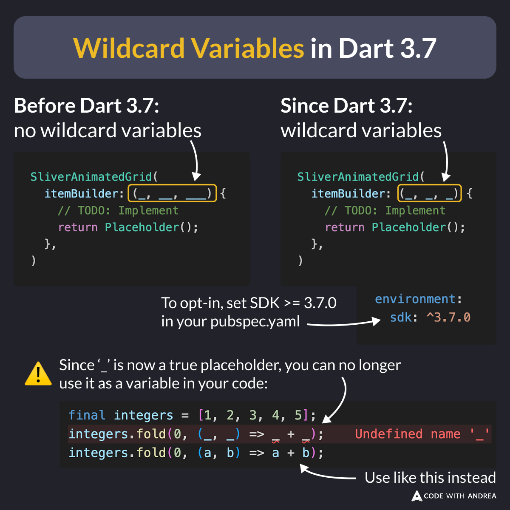

# Wildcard Variables in Dart 3.7

Did you know?

Since Dart 3.7, the `_` character is a wildcard variable.

This means that: 

- You can use it more than once in your code (e.g. inside parameter lists), without causing name collisions.
- You can't use it as an actual variable (it's only a placeholder).

<!--
// Before Dart 3.7
SliverAnimatedGrid(
  itemBuilder: (_, __, ___) {
    // TODO: Implement
    return Placeholder();
  }
)

// Since Dart 3.7
SliverAnimatedGrid(
  itemBuilder: (_, _, _) {
    // TODO: Implement
    return Placeholder();
  }
)

# To opt-in, set SDK >= 3.7.0 in your pubspec.yaml
environment:
  sdk: ^3.7.0

// Since ‘_’ is now a true placeholder, you can no longer use it as a variable in your code:
final integers = [1, 2, 3, 4, 5];
integers.fold(0, (_, _) => _ + _); // Undefined name '_'
integers.fold(0, (a, b) => a + b); // Use like this instead

-->

---

| Previous | Next |
| -------- | ---- |
| [Hotkeys with CallbackShortcuts](../0227-hotkeys-callback-shortcuts/index.md) | |

<!-- TWITTER|https://x.com/biz84/status/1889960813726998637 -->
<!-- LINKEDIN|https://www.linkedin.com/posts/andreabizzotto_did-you-know-since-dart-37-the-character-activity-7295726826046320640-5UmP  -->
<!-- BLUESKY|https://bsky.app/profile/codewithandrea.com/post/3li2crz4rw22f -->

