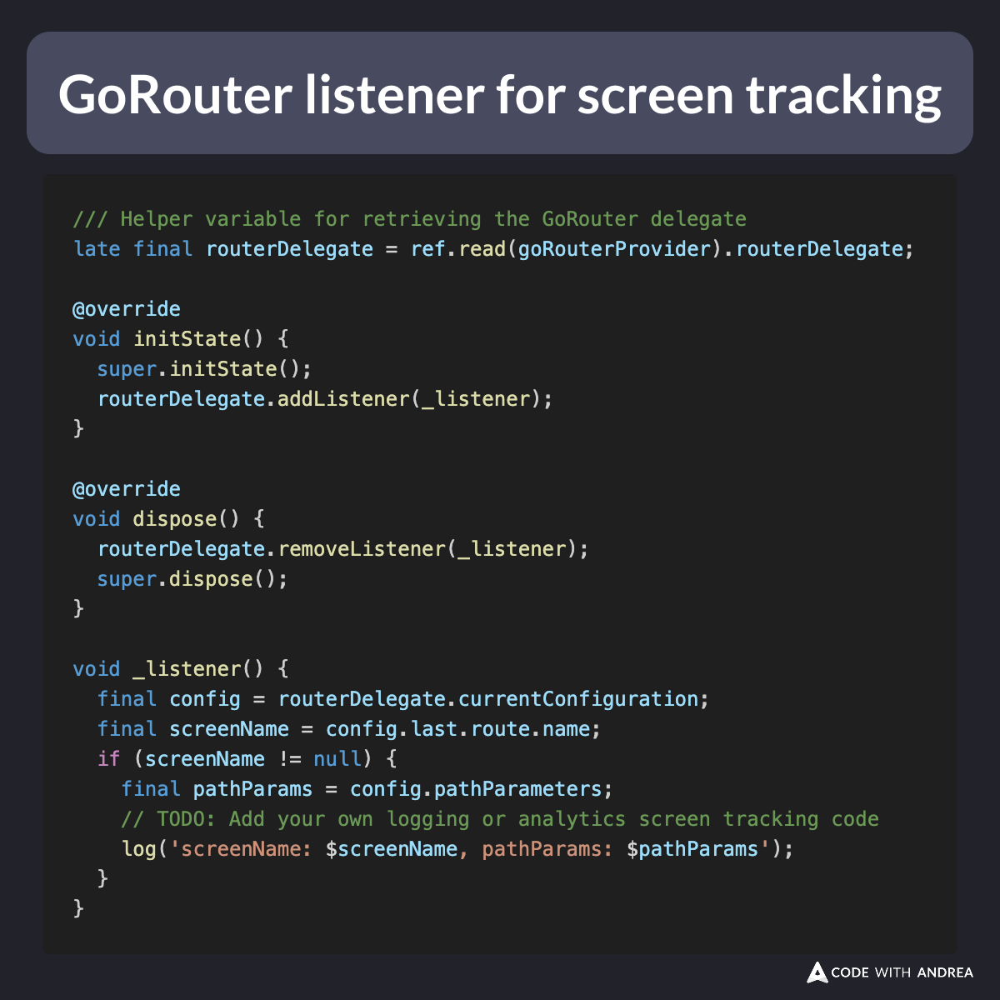

# GoRouter Delegate Listener for Screen Tracking

Did you know?

If your app uses GoRouter with shell routes, tracking screen views *reliably* requires some workarounds.

Here's how I do it (using Riverpod):

1. Declare GoRouter inside a Riverpod provider
2. Create a stateful GoRouter listener to track screen views
3. Return it inside `MaterialApp.builder`

<!--
/// Helper variable for retrieving the GoRouter delegate
late final routerDelegate = ref.read(goRouterProvider).routerDelegate;

@override
void initState() {
  super.initState();
  routerDelegate.addListener(_listener);
}

@override
void dispose() {
  routerDelegate.removeListener(_listener);
  super.dispose();
}

void _listener() {
  final config = routerDelegate.currentConfiguration;
  final screenName = config.last.route.name;
  if (screenName != null) {
    final pathParams = config.pathParameters;
    // TODO: Add your own logging or analytics screen tracking code
    log('screenName: $screenName, pathParams: $pathParams');
  }
}
-->

---

Here's a PR showing how I implemented this in my Time Tracker app:

- [Add GoRouterDelegateListener class to track screen views](https://github.com/bizz84/starter_architecture_flutter_firebase/pull/162/files)

---

And here's the original GoRouter issue showing that NavigatorObserver doesn't work with shell routes:

- [ShellRoutes seem to cause NavigatorObserver to not fire (5.0.1)](https://github.com/flutter/flutter/issues/112196)

---

| Previous | Next |
| -------- | ---- |
| [Button Styles in Material 3](../0250-button-styles-material3/index.md) | |

<!-- TWITTER|https://x.com/biz84/status/1920475265823596649 -->
<!-- LINKEDIN|https://www.linkedin.com/posts/andreabizzotto_did-you-know-if-your-app-uses-gorouter-activity-7326241428102144000-1eLq -->
<!-- BLUESKY|https://bsky.app/profile/codewithandrea.com/post/3loo2ipupr226 -->
